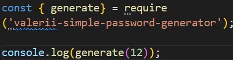
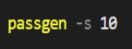

# Урок 1. Введение в Node.js
#### Напишите HTTP сервер и реализуйте два обработчика, где:
* По URL “/” будет возвращаться страница, на которой есть гиперссылка на вторую страницу по ссылке “/about”
* А по URL “/about” будет возвращаться страница, на которой есть гиперссылка на первую страницу “/”
* Также реализуйте обработку несуществующих роутов (404).
* \* На каждой странице реализуйте счетчик просмотров. Значение счетчика должно увеличиваться на единицу каждый раз, когда загружается страница.

# Урок 2. Программа для генерации паролей указанной длины 
#### `Длина - необязательный параметр, по умолчанию - 20 символов`

### добавление зависимости:

### Доступна в качестве программы из командной строки. 

Если сразу не сработает, то нужно выполнить команду `npm link`

